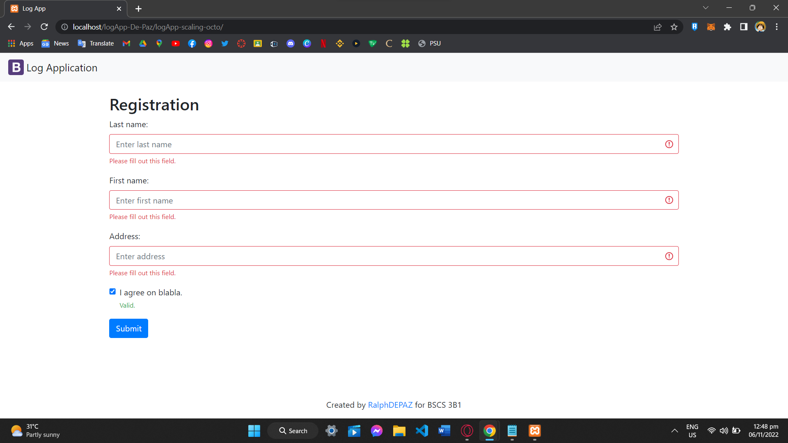
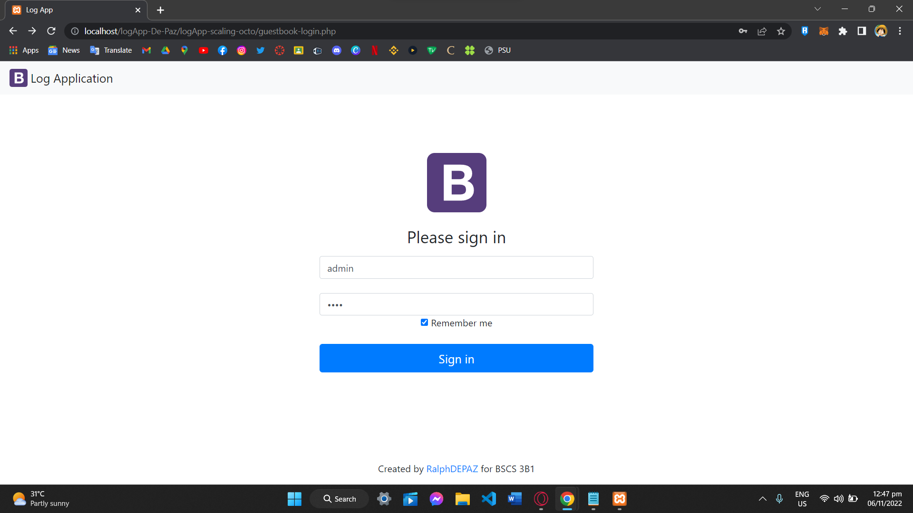
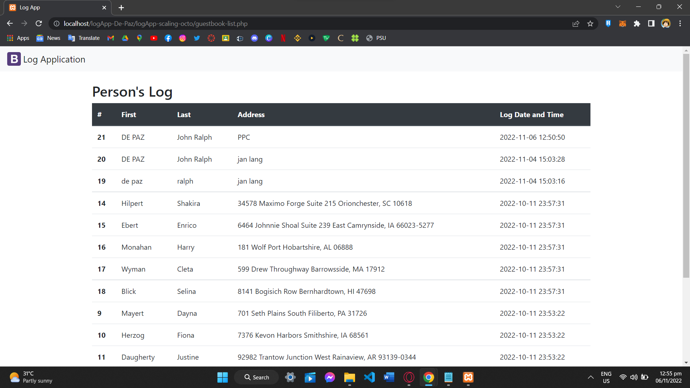

<!-- NAME -->

# COVID-19 TRACKING SYSTEM
>*logApp-De-Paz*

   

   

<!-- DESCRIPTION -->
## DESCRIPTION

  
  
This **COVID-19 TRACKING SYSTEM** is intended to assist the general public in obtaining all pertinent and important information pertaining to the scenario that would keep them well-informed and updated as well as provide them with immediate and preliminary assistance if they exhibit COVID-19 virus symptoms so they can be subjected to immediate medical attention and attending.

This will get the basic information such as name, address, and also the log date and time. The system will make sure that all of the information is safe and only admins can view the list of individuals who visited the premises.    
  

  

<!-- VISUAL   -->
 

      
 

 
 

| | | |
|:-------------------------:|:-------------------------:|:-------------------------:|
|  REGISTRATION |    LOG IN PAGE |    PERSON'S LOG |  

  
 

<!--INSTALLATION -->
## INSTALLATION

- First clone this repository (https://github.com/RalphDePaz/logApp-De-Paz.git)

- Download and install XAMPP [Open-source cross-platform web server solution stack package]
  - XAMPP download link (https://www.apachefriends.org)  
    - Open XAMPP as administrator
      - Start MySQL
  
- Create a account on https://www.freesqldatabase.com
  - You will receive an email you can use later on 
  - Log in into the PhpMyAdmin

- *You can also use MySQL Workbench*

- Set up your data base
  - Create a table for the PERSON [uid, first_name, last_name, address, and logdt]
  - Create a table for the ACCOUNT [uid, username, password]
    -  *Make sure that the logdt is set to TIMESTAMP and default CURRENT TIMESTAMP*

- Locate the cloned repository and open the config.php file on VSCODE or any software you want.
  - Edit this base on what the freesqldatabe email you received.
  >define('ROOT_URL', ''); define('DB_HOST', ''); define('DB_USER', ''); define('DB_PASS', '');  define('DB_NAME', '');

- You can test your file direct on VSCODE using some extension
- You can also test it using the XAMPP
  - Move your folder in the XAMPP/htdocs file location
  >D:\Program Files\Xampp\htdocs

- To test using XAMPP
  - Use any browser you want and type this
    - Registration Form
    - >http://localhost/"Your_Foldername"/logApp-scaling-octo/
    - Log In Page
    - >http://localhost/"Your_Foldername"/logApp-scaling-octo/guestbook-login.php
    - Person's Log
    - >http://localhost/"Your_Foldername"/logApp-scaling-octo/guestbook-list.php
    
                                                                                                                                          
<!-- PROFILE   -->                                                                                                                                         

## AUTHOR
                                                                                                                                       

     

 

 
  
## John Ralph De Paz
                                                                                                                                  
*BSCS 3B-1*                                                                                                                                 

[GitHub ](https://github.com/RalphDePaz)

[Email 📬](mailto:202080468@psu.palawan.edu.ph)
  

| | | 
|:-------------------------:|:-------------------------:|
|  REGISTRATION |    LOG IN PAGE | 
